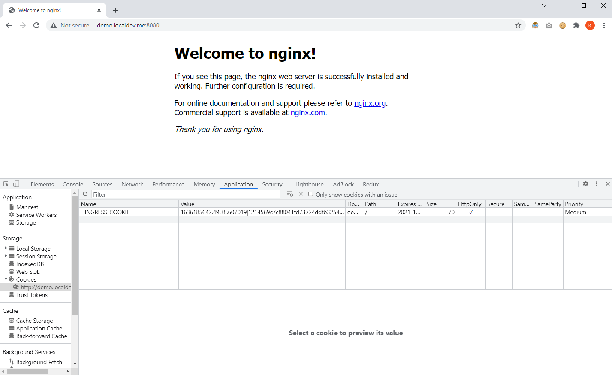
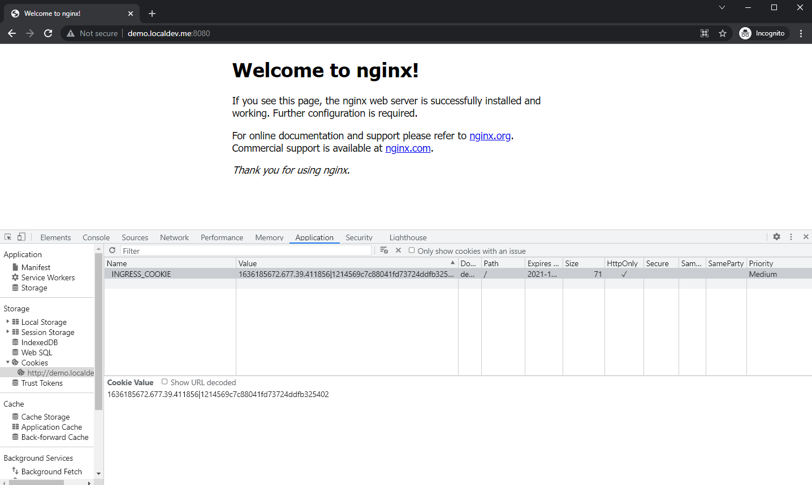

# Advanced Kubernetes Features

To implement a load balancer and horizontal pod auto-scaler for the deployed image.

## Ingress with Sticky Session

### 1. Ensure Docker desktop is configured with Kubernetes

- Go to settings &#8594; Kubernetes
- Check the option 'Enable Kubernetes'
- Click 'Apply & Restart'

### 2. Expose pods to the cluster

Pods are configured in the yaml file. The image used is nginx. Create Deployment by running the following command:

```
$ kubectl apply -f ./run-my-nginx.yaml
deployment.apps/my-nginx created
```

After a few moments, the Deployments should be ready. You can check running Deployments by executing the command:

```
$ kubectl get deployments
NAME       READY   UP-TO-DATE   AVAILABLE   AGE
my-nginx   2/2     2            2           23m
```

In this Deployment, we have specified 2 replicas in `run-my-nginx.yaml`. You can check running Pods too by running:

```
$ kubectl get pods
NAME                        READY   STATUS    RESTARTS   AGE
my-nginx-5b56ccd65f-4sv4j   1/1     Running   0          9m26s
my-nginx-5b56ccd65f-nhrvb   1/1     Running   0          9m26s
```

### 3. Expose the Deployment

This is to create a Service for `my-nginx` Deployment.

```
$ kubectl expose deployment my-nginx
service/my-nginx exposed
```

```
$ kubectl get service
NAME         TYPE        CLUSTER-IP       EXTERNAL-IP   PORT(S)   AGE
kubernetes   ClusterIP   10.96.0.1        <none>        443/TCP   5d19h
my-nginx     ClusterIP   10.96.195.245    <none>        80/TCP    4s
```

## 4. Prerequisite: Install Ingress Controller

Following this link: https://kubernetes.github.io/ingress-nginx/deploy/

First, we need to install NGINX Ingress Controller for Ingress to work. Before running the following installation command, make sure Kubernetes is enabled at Docker settings.

```
$ kubectl apply -f https://raw.githubusercontent.com/kubernetes/ingress-nginx/controller-v1.0.4/deploy/static/provider/cloud/deploy.yaml
namespace/ingress-nginx created
serviceaccount/ingress-nginx created
configmap/ingress-nginx-controller created
clusterrole.rbac.authorization.k8s.io/ingress-nginx created
clusterrolebinding.rbac.authorization.k8s.io/ingress-nginx created
role.rbac.authorization.k8s.io/ingress-nginx created
rolebinding.rbac.authorization.k8s.io/ingress-nginx created
service/ingress-nginx-controller-admission created
service/ingress-nginx-controller created
deployment.apps/ingress-nginx-controller created
ingressclass.networking.k8s.io/nginx created
validatingwebhookconfiguration.admissionregistration.k8s.io/ingress-nginx-admission created
serviceaccount/ingress-nginx-admission created
clusterrole.rbac.authorization.k8s.io/ingress-nginx-admission created
clusterrolebinding.rbac.authorization.k8s.io/ingress-nginx-admission created
role.rbac.authorization.k8s.io/ingress-nginx-admission created
rolebinding.rbac.authorization.k8s.io/ingress-nginx-admission created
job.batch/ingress-nginx-admission-create created
job.batch/ingress-nginx-admission-patch created
```

A few pods should start at `ingress-nginx` namespace.

```
$ kubectl get pods --namespace=ingress-nginx
NAME                                        READY   STATUS      RESTARTS   AGE
ingress-nginx-admission-create-7mhhk        0/1     Completed   0          54s
ingress-nginx-admission-patch-k9zjw         0/1     Completed   1          54s
ingress-nginx-controller-5c8d66c76d-6zb2h   1/1     Running     0          54s
```

With Ingress Controller set up, we can now apply the Ingress resource.

## 2. Apply Ingress with sticky session

Following: https://kubernetes.github.io/ingress-nginx/deploy/ 

`ingress-nginx.yaml` file is configured with ingress rules and sticky session, where the backend Service is `my-nginx` created previously. Run the following command to apply the Ingress:

```
$ kubectl apply -f ./ingress-nginx.yaml
ingress.networking.k8s.io/ingress-nginx created
```

```
$ kubectl get ingress
NAME            CLASS   HOSTS              ADDRESS   PORTS   AGE
ingress-nginx   nginx   demo.localdev.me             80      3s
```

Next, forward the local port to the Ingress controller. This needs to be done for local testing, as `demo.localdev.me` is not a deployed endpoint.

```
$ kubectl port-forward --namespace=ingress-nginx service/ingress-nginx-controller 8080:80
Forwarding from 127.0.0.1:8080 -> 80
Forwarding from [::1]:8080 -> 80
```

Side note: You can restart the whole process with

```
$ kubectl delete namespace ingress-nginx
```

To test out sticky sessions, keep the above terminal running and test it out in browser.

- Access `http://demo.localdev.me:8080/` and check for cookies. `INGRESS_COOKIE` will be set and it will not change after refreshing the page.



- Test it out in another browser to see a different cookie value, which also does not change after refreshing the page.




### Additional Reading: Ingress vs Ingress Controller

In order for the Ingress resource to work, the cluster must have an ingress controller running.

Ingress should be the rules for the traffic, which indicate the destination of a request will go through in the cluster. Ingress Controller is the implementation for the Ingress.

## Horizontal Pod Autoscaler (HPA)

Define a horizontal pod autoscaler as such:

```
$ kubectl autoscale deployment my-nginx --cpu-percent=50 --min=1 --max=10
horizontalpodautoscaler.autoscaling/my-nginx autoscaled
```

Check the initial state of HPA:

```
$ kubectl get hpa
NAME         REFERENCE               TARGETS   MINPODS   MAXPODS   REPLICAS   AGE
my-nginx     Deployment/my-nginx     0%/50%    1         10        2           3m
```

Check the initial state of pods:

```
$ 
NAME                         READY   STATUS    RESTARTS   AGE
my-nginx-5cfd745b65-dl5ts    1/1     Running   0           3m
my-nginx-5cfd745b65-mldw5    1/1     Running   0           3m
```

Run the python script to increase the load. The python scripts creates an infinite loop of GET request. Remember to keep the `kubectl port-forward` process running.

```
$ python request.py
```

Check the state of HPA with python script running. Notice that the number of replicas increases to handle the increased load.

```
$ kubectl get hpa
NAME         REFERENCE               TARGETS    MINPODS   MAXPODS   REPLICAS   AGE
my-nginx     Deployment/my-nginx     212%/50%   1         10        8          17m
```

Check the running pods:

```
$ kubectl get pods
NAME                         READY   STATUS    RESTARTS   AGE
my-nginx-5cfd745b65-56d9j    1/1     Running   0          2m57s
my-nginx-5cfd745b65-8hqfs    1/1     Running   0          57s
my-nginx-5cfd745b65-dl5ts    1/1     Running   0          19m
my-nginx-5cfd745b65-f7r8q    1/1     Running   0          57s
my-nginx-5cfd745b65-fk2c2    1/1     Running   0          2m57s
my-nginx-5cfd745b65-fqnwl    1/1     Running   0          117s
my-nginx-5cfd745b65-j4l6h    1/1     Running   0          117s
my-nginx-5cfd745b65-k6t6b    1/1     Running   0          117s
my-nginx-5cfd745b65-mldw5    1/1     Running   0          7m33s
my-nginx-5cfd745b65-xptd8    1/1     Running   0          117s
```

Stop the load and HPA metrics should be uploaded in a few moment. The redundant replicas takes a while to terminate.

```
$ kubectl get hpa
NAME         REFERENCE               TARGETS   MINPODS   MAXPODS   REPLICAS   AGE
my-nginx     Deployment/my-nginx     0%/50%    1         10        10         37m
```

You should see the pods terminating after a while. Please be patient because it takes a while.

```
$ kubectl get pods
NAME                         READY   STATUS        RESTARTS   AGE
my-nginx-5cfd745b65-5cgcs    0/1     Terminating   0          7m12s
my-nginx-5cfd745b65-clnsz    0/1     Terminating   0          6m12s
my-nginx-5cfd745b65-dl5ts    1/1     Running       0          9m4s
my-nginx-5cfd745b65-fj7wr    1/1     Running       0          7m12s
my-nginx-5cfd745b65-jd6xt    0/1     Terminating   0          6m12s
my-nginx-5cfd745b65-nrgdz    0/1     Terminating   0          6m12s
my-nginx-5cfd745b65-s9tcw    1/1     Running       0          8m50s
my-nginx-5cfd745b65-wk87g    0/1     Terminating   0          5m12s
my-nginx-5cfd745b65-z8jjs    0/1     Terminating   0          6m12s
```

You can also check the history of how HPA autoscales by running:

```
$ kubectl describe hpa my-nginx
Name:                                                  my-nginx
Namespace:                                             default
Labels:                                                <none>
Annotations:                                           <none>
CreationTimestamp:                                     Sat, 06 Nov 2021 16:58:30 +0800
Reference:                                             Deployment/my-nginx
Metrics:                                               ( current / target )
  resource cpu on pods  (as a percentage of request):  0% (0) / 50%
Min replicas:                                          1
Max replicas:                                          10
Deployment pods:                                       1 current / 1 desired
Conditions:
  Type            Status  Reason            Message
  ----            ------  ------            -------
  AbleToScale     True    ReadyForNewScale  recommended size matches current size
  ScalingActive   True    ValidMetricFound  the HPA was able to successfully calculate a replica count from cpu resource utilization (percentage of request)
  ScalingLimited  True    TooFewReplicas    the desired replica count is less than the minimum replica count
Events:
  Type     Reason                        Age                 From                       Message
  ----     ------                        ----                ----                       -------
  Warning  FailedGetResourceMetric       11m (x13 over 23m)  horizontal-pod-autoscaler  failed to get cpu utilization: missing request for cpu
  Warning  FailedComputeMetricsReplicas  11m (x13 over 23m)  horizontal-pod-autoscaler  invalid metrics (1 invalid out of 1), first error is: failed to get cpu utilization: missing request for cpu
  Warning  FailedGetResourceMetric       10m                 horizontal-pod-autoscaler  failed to get cpu utilization: did not receive metrics for any ready pods
  Normal   SuccessfulRescale             8m4s                horizontal-pod-autoscaler  New size: 8; reason: cpu resource utilization (percentage of request) above target
  Normal   SuccessfulRescale             2m4s                horizontal-pod-autoscaler  New size: 3; reason: All metrics below target
  ```


## References

- Ingress + Sticky session:
    - https://kubernetes.github.io/ingress-nginx/
    - https://kubernetes.github.io/ingress-nginx/deploy/
    - https://kubernetes.io/docs/concepts/services-networking/ingress/
    - https://kubernetes.github.io/ingress-nginx/examples/affinity/cookie/
- HPA: https://kubernetes.io/docs/tasks/run-application/horizontal-pod-autoscale-walkthrough/